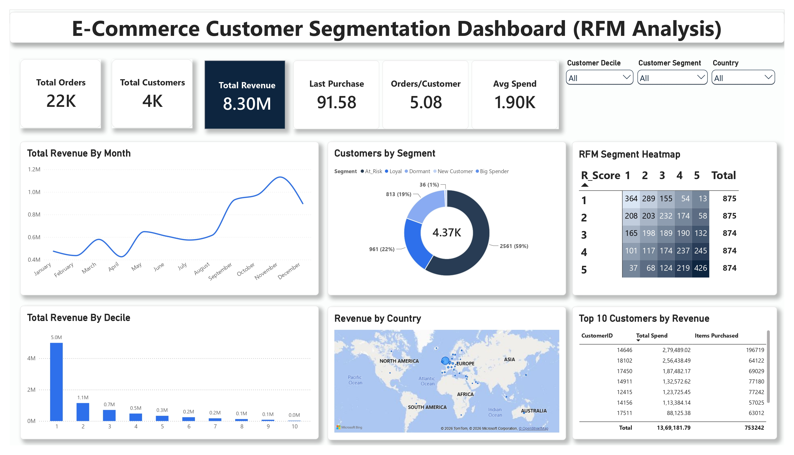

# E-Commerce Customer Segmentation (RFM Analysis)

Segmenting customers of a UK online retailer using RFM (Recency, Frequency, Monetary) analysis to support targeted marketing and budget allocation.

## Business Problem
Retail businesses collect large amounts of transaction data but often don't use it to understand their customers: who is most valuable and who is at risk of leaving. This project segments customers using RFM analysis and turns the segments into targeted marketing recommendations.

## Dataset
- UK Online Retail transactional dataset (~542,000 rows)
- Source: [UCI Machine Learning Repository – Online Retail](https://archive.ics.uci.edu/dataset/352/online+retail)
- Raw data: `data/data.zip` (unzip to get the CSV used in the SQL scripts)

## Tools
SQL Server (T-SQL) · Power BI (DAX) · Python (pandas, Jupyter) · PowerPoint

## Approach
1. **Data exploration** – `sql/01_Exploring_Data.sql`
2. **Cleaning and RFM scoring** – `sql/02_Cleaning_and_RFM.sql`
   - Removed rows with missing CustomerID and invalid negative quantities
   - Kept cancellations with an IsCancellation flag (406,829 clean rows)
   - Calculated Recency, Frequency and Monetary values per customer and scored each from 1 to 5 using NTILE(5)
3. **Exploratory analysis** – `sql/03_EDA_Analysis.sql`
4. **Dashboard** – `powerbi/E_Com_Dashboard.pbix`
5. **Validation** – `python/RFM_Validation.ipynb` rebuilds the RFM logic in pandas and confirms the segment counts match the SQL and Power BI results

## Customer Segments and Marketing Budget Allocation
Budget is allocated by expected return on investment per customer:

| Segment | Budget share |
|---|---|
| Loyal | 40% |
| At-Risk | 30% |
| Dormant | 15% |
| New Customer | 10% |
| Big Spender | 5% |

Detailed recommendations for each segment are in the presentation: `docs/Customer_Segmentation_RFM_Analysis.pptx`

## Repository Structure
- `sql/` – data exploration, cleaning, RFM scoring and EDA scripts
- `powerbi/` –
